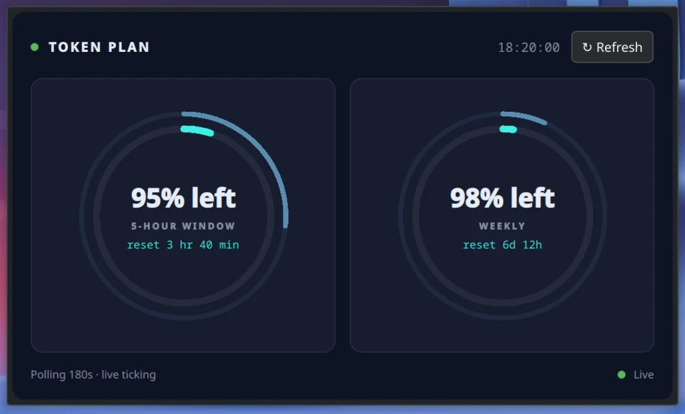

# MiniMax Quota — KDE Plasma 6 Widget

A Plasma 6 plasmoid that shows your MiniMax M3 Token Plan usage — both
the 5-hour and weekly windows — with live reset countdowns. Two
concentric rings per card let you see at a glance whether you're
pacing your consumption against the window.



> **Note:** the screenshot above shows a real working session
> (`97% left` / `98% left` on the user's data, real API timestamps).
> Your numbers will reflect your own usage.

## Features

- **5-hour window** card with concentric rings: outer = time elapsed,
  inner = quota used. Compare the two to spot over- or under-utilization.
- **Weekly window** card with the same layout.
- **Color-coded** inner ring: cyan when safe → orange (< 1h reset) →
  red (< 30m reset).
- **Stats view** with two bar charts: 5-hour window over the last 7 days,
  weekly window over the last 3 months. Shows current, average, and
  peak usage. Hover any bar to see the exact timestamp + value. Click
  the **Stats** tab in the header to switch.
- **Live-ticking** countdowns (subtract elapsed since fetch each second —
  no network call to decrement).
- **Live clock** in the header (HH:MM:SS, ticks every second).
- **Manual refresh** button + auto-polling (configurable, default **300s
  / 5 min**, range 60–3600s).
- **Layout switch** in config: horizontal (cards side-by-side, default)
  or vertical (stacked, for narrow panels).
- **History retention** configurable per window (default 7d for 5h,
  90d for weekly). Clear button wipes stored history.
- **API key** entered once via the widget's config dialog, stored via
  `QtCore.Settings` in `~/.config/plasma-workspace/`. **Never** in the repo,
  never in logs, never on the wire except as a Bearer token to MiniMax.
- **Pure QML + Node smoke-test**, no build step, no npm install.
- **Smoke-test** validates parsing + formatting without a Plasma install.

## Requirements

- KDE Plasma 6 (tested on 6.7)
- A MiniMax M3 Token Plan subscription (get a key from
  [Billing → Token Plan](https://platform.minimax.io/user-center/payment/token-plan))

## Install

```bash
git clone https://github.com/spy4x/minimax-usage-kde-widget
cd minimax-usage-kde-widget
./install.sh
```

`install.sh` **copies** the plasmoid into `~/.local/share/plasma/plasmoids/`
(rather than symlinking) so the install survives even if the source repo
is moved, renamed, or wiped. After editing QML/JSON, re-run `./install.sh`
to refresh the copy.

Then:

1. Right-click desktop or panel → **Add Widgets...**
2. Search **"MiniMax"** (or `org.spy4x.minimaxquota`)
3. Drag the widget onto your desktop or panel
4. Right-click the widget → **Configure MiniMax Quota...**
5. Paste your Token Plan **Subscription Key** (format `sk-cp-...`)
6. Click OK. Widget polls within ~1 second.

If the widget doesn't appear in Add Widgets after install, log out and
back in (Wayland often requires a full session restart).

## Configuration

Right-click the widget → **Configure MiniMax Quota...**

| Field | Default | Notes |
|---|---|---|
| **API Key** | *(empty)* | MiniMax subscription key, `sk-cp-...`. Stored via `QtCore.Settings`. |
| **Refresh (sec)** | `300` | Poll interval. Range 60–3600. 5 min is conservative; lower if you want more responsive updates. |
| **Endpoint** | `https://www.minimax.io/v1/token_plan/remains` | Override only if MiniMax changes the URL. |
| **Layout** | `Horizontal` | `Horizontal` = cards side by side. `Vertical` = cards stacked (use for narrow panels). |
| **5h retention (days)** | `7` | Oldest 5-hour-window samples older than this are dropped on every save. |
| **Weekly retention (days)** | `90` | Same, for the weekly window. |
| **Clear history now** | — | Wipes stored samples for **this** subscription key only. Other subscriptions are unaffected. |

History is always collected while an API key is configured, and is keyed
to that key (hashed) so two subscriptions never share data.

## Reading the stats view

Click the **Stats** tab in the header to switch from the live rings to a
historical view. Two stacked bar charts:

- **5-hour window — last 7 days**: one bar per ~7 minutes of recorded
  data (max 200 bars shown). Useful for spotting peak usage hours.
- **Weekly window — last 90 days**: one bar per ~6 hours. Spans three
  monthly reset cycles so you can compare how aggressively you used
  quota across billing cycles.

Bars are positioned by **timestamp**, not by index — gaps between bars
show time gaps, so a brand-new install with only a handful of samples
displays as a few narrow ticks at their actual times, not as wide bars
stretched across the whole chart. Hover any bar to see its exact
timestamp + value.

Each chart shows three numbers on the right: `now` (current usage,
color-coded), `avg` (average used % over the window), and `peak`
(highest used % reached). Bars are colored the same as the live rings:
cyan < 70%, orange < 90%, red ≥ 90%.

Empty state: if you just installed, the chart shows *"Collecting data —
check back after a few hours"*. The first sample lands within seconds of
the first successful fetch.

History is stored per subscription key (hashed). Removing and re-adding
the widget keeps your data as long as the same API key is configured;
switching to a different key starts a fresh history for that key.

## Reading the rings

Each card has two concentric rings:

- **Outer (slate)**: percent of the window's TIME elapsed. 3h elapsed
  of 5h window = 60% outer fill.
- **Inner (cyan/orange/red)**: percent of quota USED.

Compare the two:

- Inner fill > outer fill → you're using quota faster than the window
  is passing. You'll exhaust before reset.
- Inner fill < outer fill → you're under-utilizing. Room to do more.
- Roughly equal → on pace.

## API

The widget queries the public Token Plan usage endpoint:

```
GET https://www.minimax.io/v1/token_plan/remains
Authorization: Bearer <your-token-plan-key>
```

The JSON response contains a `model_remains` array. The widget filters
for `model_name == "general"` and reads:

- `current_interval_remaining_percent` — 5-hour window, 0..100 (100 = unused)
- `current_weekly_remaining_percent` — weekly window, 0..100
- `remains_time` — milliseconds until the 5-hour window resets
- `weekly_remains_time` — milliseconds until the weekly window resets

A non-zero `base_resp.status_code` or an HTTP error is surfaced
in the widget as a red error label.

## Security

- The API key is stored in `~/.config/plasma-workspace/` via
  `QtCore.Settings`. It's **never** hardcoded into the widget, the
  repo, or logs.
- For extra hardening, restrict permissions on the settings file:

  ```bash
  chmod 600 ~/.config/plasma-workspace/*minimaxquota*.conf
  ```

- **Never share your key.** If you leak it (chat, screenshot, public
  issue, even your own terminal scrollback), rotate it in the MiniMax
  dashboard **immediately** — the old value is compromised the moment
  it appears in any delivered state, including provider retention logs.

## Files

```
org.spy4x.minimaxquota/           # the plasmoid source
├── metadata.json
└── contents/
    ├── config/
    │   ├── config.qml            # ConfigModel with General category
    │   └── ui/ConfigGeneral.qml  # configuration dialog form
    └── ui/
        ├── main.qml              # full representation (the tile you see)
        ├── CompactRepresentation.qml
        ├── QuotaCard.qml         # reusable card with concentric rings
        ├── HistoryStore.qml      # persistence (QtCore.Settings, JSON)
        ├── HistoryChart.qml      # bar chart component with min/max envelope
        └── StatsView.qml         # stacked charts for both windows
install.sh                        # copy into ~/.local/share/plasma/plasmoids/
scripts/smoke-test.mjs            # node test for parsing & formatting
docs/
└── preview.webp                  # screenshot (~19 KB)
README.md
LICENSE                           # MIT
CONTRIBUTING.md
CHANGELOG.md
.github/
├── ISSUE_TEMPLATE/
│   ├── bug_report.md
│   └── feature_request.md
└── PULL_REQUEST_TEMPLATE.md
```

## Development

### Smoke-test without Plasma

```bash
node scripts/smoke-test.mjs
```

This validates the response parsing, `formatDuration`, `usedFromRemaining`,
history append/prune, downsample logic, and the chart helpers
(`fmtAxisDate`, `barX`, `barWidth`) + history namespace helpers
(`namespaceOf`, `migrateLegacyBlob`) without needing Plasma installed.
31/31 should pass.

### Iterate on QML

1. Edit files under `org.spy4x.minimaxquota/contents/`
2. Run `./install.sh` (copies into the Plasma user-local path)
3. Trigger a shell refresh:

   ```bash
   busctl --user call org.kde.plasmashell /PlasmaShell org.kde.PlasmaShell.refreshCurrentShell 0
   ```

4. Remove the widget from desktop → re-add from **Add Widgets...**
   to clear the per-instance QML cache.

### Style

- 2-space indent, double quotes, no semicolons, trailing commas where legal.
- Plasmoid source stays inside `org.spy4x.minimaxquota/`. No build tooling.
- Conventional commits (`feat|fix|style|refactor(scope): subject`),
  ≤72 chars, no trailing period, no AI attribution.
- Bump `metadata.json` `KPlugin.Version` on user-visible changes.

See [CONTRIBUTING.md](CONTRIBUTING.md) for the full contribution flow.

## License

MIT — see [LICENSE](LICENSE).

## Acknowledgements

- [Plasma 6 porting guide](https://develop.kde.org/docs/plasma/widget/porting_kf6/)
  for the `PlasmoidItem` root, `KCM.SimpleKCM` config, and `theme` → `PlasmaCore.Theme`
  migration.
- KDE Plasma team for the framework that makes this possible.
